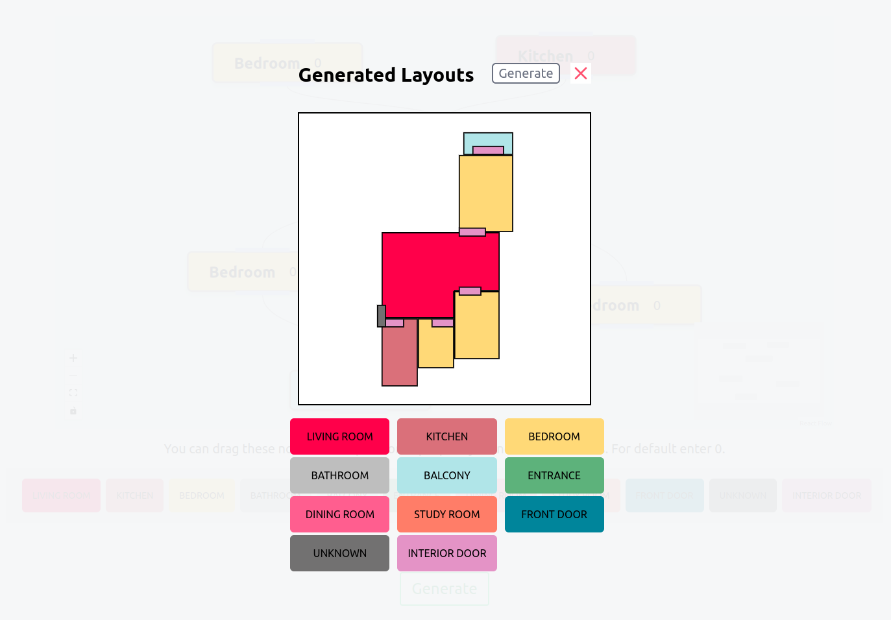

# HouseDiffusion Frontend
**[HouseDiffusion: Vector Floorplan Generation via a Diffusion Model with Discrete and Continuous Denoising](https://arxiv.org/abs/2211.13287)**


## Installation

**1. Clone repo and install the requirements:**

My implementation is based on the public implementation of [HouseDiffusion](https://github.com/aminshabani/house_diffusion.git). 

```
git clone https://github.com/sakmalh/FE-Diffusion
npm install
export REACT_APP_API_HOSTNAME={BACKEND API} 
npm start
```
**2. Frontend Features**

- Drag and Drop Rooms from the bottom panel
- Connect Rooms with edges 
- Specify corners in each room (If you dont want to specify. Leave it at "0")
- Toggle Metrics if measurements are required
- Click Generate



## Deployment

- DockerFile is provided for hosting. 

```
docker build -t {docker-repo}/frontend .
```
## Citation

```
@article{shabani2022housediffusion,
  title={HouseDiffusion: Vector Floorplan Generation via a Diffusion Model with Discrete and Continuous Denoising},
  author={Shabani, Mohammad Amin and Hosseini, Sepidehsadat and Furukawa, Yasutaka},
  journal={arXiv preprint arXiv:2211.13287},
  year={2022}
}
```
